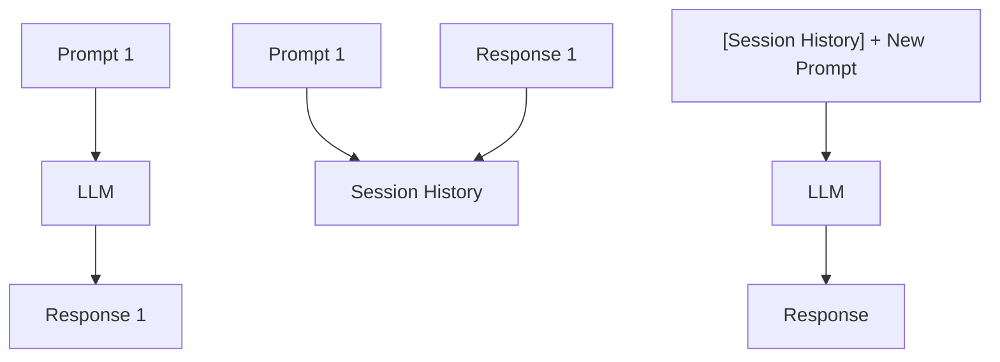
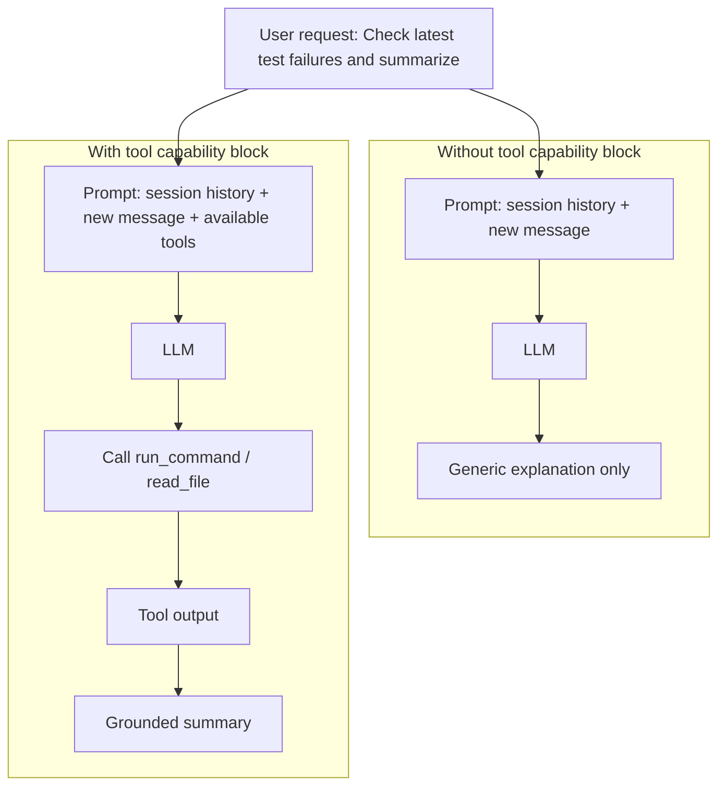
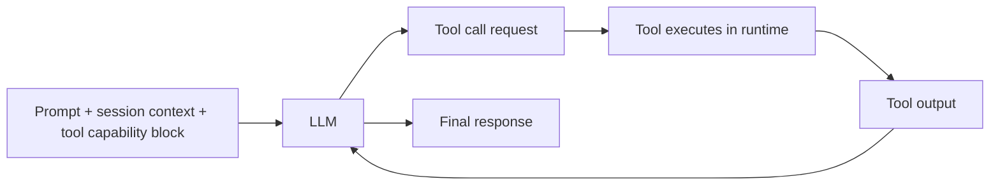
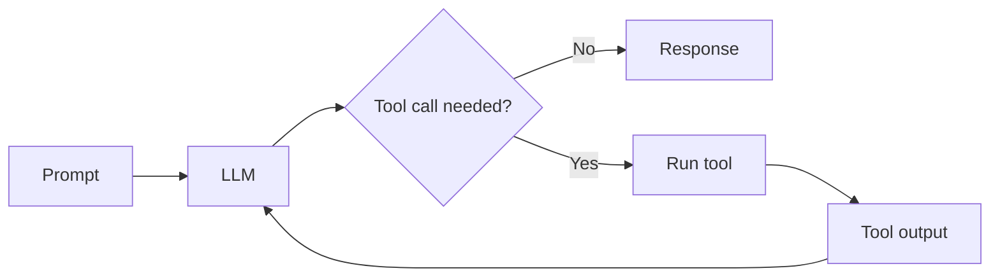
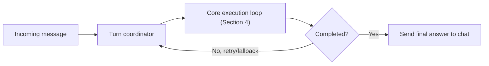

# How OpenClaw Works, Step by Step

This article explains OpenClaw from first principles.

The goal is to make the architecture easy to follow without buzzwords. We start with the smallest useful building block of modern AI systems: one prompt in, one response out. From there, we add exactly the pieces needed to turn that into a practical, always-on assistant that lives in chat apps.

---

## 1) The Smallest Building Block: Prompt -> Response

At the core, an LLM is simple.

You send text (the prompt).  
It returns text (the response).


If all you ever do is this single request/response pattern, you run into limits quickly:

- The model does not automatically "remember" your previous day of conversations.
- It cannot run tools unless you explicitly build that loop.
- It has no durable identity unless you keep injecting one.
- It cannot send a reply back into WhatsApp, Telegram, Discord, and so on by itself.

So, a plain LLM call is useful, but not enough for a real assistant.

### Highlights

- Prompt -> response is the foundation.
- Everything else in OpenClaw exists to make that foundation useful in the real world.

---

## 2) The Next Step: Session Memory

The next obvious improvement after one-shot prompt/response is continuity.

In real conversations, each new message depends on what came before. If the model only sees the latest prompt, it loses context every turn.

So the system needs session memory: store prior turns and include relevant history in the next request.

At this stage, we still do not need an agent loop. We just need "prompt + prior context" instead of "prompt alone."



### Highlights

- Session memory is about continuity across turns.
- It is a separate concern from tool use and agent loops.

---

## 3) The Next Step: Tools

Even with session memory, the model is still limited to text generation.

It cannot actually do things like:

- read a file,
- run a command,
- send a message to another channel,
- set a reminder.

Tools are the bridge between language and action. The model proposes an action, the system executes it, and the result is fed back to the model.

This is the key transition from "chatbot that talks" to "assistant that can act."

There is one subtle but important detail here: the model can only use tools it knows about.  
So tool availability must be injected into the prompt for that turn.

In practice, each turn needs two things:

1. The user/task context.
2. A tool capability block (which tools exist, what they do, and limits/policies).

Without that capability block, the model may either:

- fail to call a tool that exists, or
- invent a tool that does not exist.

Small illustration:





### Highlights

- Tools give the assistant real-world capabilities.
- Tool availability must be part of turn context, not hidden out-of-band.
- The runtime must execute tools safely and feed results back to the model.

---

## 4) From Session + Tools to Agentic Loop

An assistant becomes "agentic" when it can do more than answer once. It needs to think in turns:

1. Read user input and current context.
2. Decide whether to call a tool.
3. Observe tool output.
4. Continue until it has a final response.



The loop itself is the core behavior. The next question is how to run that loop reliably in production.

### Highlights

- Agentic behavior is iterative, not one-shot.
- The loop itself is model -> tool -> observe -> continue until done.

---

## 5) Orchestration Around the Loop

A toy loop is easy to draw, but production assistants need operational control around that loop.

OpenClaw splits this into two layers with different jobs:

- **Core execution loop (inside the run)**
  - sends prompt + context to the model,
  - executes requested tools,
  - feeds tool results back to the model,
  - repeats until the model returns a final answer.
- **Turn coordinator (outside the loop)**
  - chooses which model to use for this turn,
  - prepares what goes into the prompt (recent messages + instructions),
  - starts the core execution loop and watches whether the run succeeds,
  - if needed, retries or switches model/provider,
  - sends the final answer back to the same chat.

Start from the familiar part: the core execution loop is exactly the loop from Section 4. The turn coordinator is the wrapper that makes that loop reliable in production.



Example in one turn:

1. A Telegram message arrives.
2. The turn coordinator prepares prompt context, picks model/provider, and starts the run.
3. The core execution loop does model -> tool -> model iterations.
4. If the run fails (timeout/tool/provider issue), control returns to the turn coordinator for retry/fallback policy.
5. If the run succeeds, the turn coordinator sends the final response back to the same Telegram chat.

This split keeps the system understandable because failures and routing live in the turn coordinator, while reasoning-and-tools behavior lives in the core execution loop.

### Highlights

- The loop is only one part of the system.
- Orchestration handles retries, failures, and delivery routing around the loop.

---

## 6) Why Session History Alone Is Not Enough

Section 2 introduced session memory: include prior turns so the model has continuity.

That is necessary, but not sufficient.

If you only send "new message + session history," important context is still missing.

Imagine this incoming message:

> "Please send a short update to the team, and mention the last deploy issue."

Session history alone does not tell the model:

- what "short update" style is expected,
- whether it is allowed to send outbound messages in this chat context,
- which tools are currently available for messaging,
- which durable memory contains "last deploy issue,"
- which workspace/runtime constraints apply right now.

So production systems need more than history replay. They need a structured way to assemble context from multiple sources into one turn prompt.

That is the prompt compiler idea.

A practical compiled prompt is usually shaped like this:

```text
[System behavior + safety rules]
[Assistant identity/persona instructions]
[Tool capability block + limits]
[Session history excerpt]
[Durable memory snippets]
[Current user message]
```

Now the model can answer with the right behavior, use real tools, and stay grounded in both recent and durable context.

### Highlights

- Session history gives continuity, but not full operating context.
- Rich context is assembled from behavior rules, tools, memory, and current constraints.
- Prompt compilation is how multiple context sources become one reliable turn prompt.

---

## 7) From One Provider to Many Providers

Supporting one model provider is straightforward. Supporting many is hard in practice:

- APIs differ.
- streaming formats differ,
- tool-calling behavior differs,
- auth modes differ,
- usage/cost reporting differs.

OpenClaw handles this with two layers:

1. A provider abstraction layer for model APIs and agent behavior.
2. OpenClaw-level policy for model selection, fallback, retries, auth profile rotation, and channel-safe delivery.

That second layer is important. Even with a unified API, operations still fail in real life: rate limits, timeouts, transient network errors, context overflow, and provider-specific quirks. OpenClaw explicitly plans for these cases.

### Highlights

- Multi-provider support is both an API problem and an operations problem.
- OpenClaw adds reliability logic on top of provider abstraction.

---

## 8) The Prompt Compiler: The Most Important Layer

The single biggest quality lever in an agent system is context quality.

OpenClaw uses a prompt compiler pattern: for each turn, it builds a full runtime prompt from multiple context sources, not just the latest message text.

It merges:

- system instructions,
- workspace bootstrap files (identity, behavior, persona, user profile),
- session/channel metadata,
- thread/group context,
- tool availability and runtime capabilities,
- optional skill/memory guidance.

This is how OpenClaw gets predictable behavior from a general-purpose model.

Instead of asking the model to "somehow remember who it is," OpenClaw injects that identity and policy each turn from files and config. This makes behavior changeable, inspectable, and versionable.

### Highlights

- Prompt quality is architecture, not luck.
- OpenClaw compiles context each turn from structured sources.

---

## 9) Memory as Layers, Not One Feature

When people say "memory," they often mean different things. OpenClaw treats memory as multiple layers with different jobs.

### 9.1 Transcript memory (conversation continuity)

Each session is persisted in transcript files. On the next turn, prior messages are replayed via session management, so the model sees the recent conversation history.

This is your short-term continuity layer.

### 9.2 Semantic durable memory

OpenClaw also supports semantic retrieval from memory files (`MEMORY.md` and `memory/*.md`) via memory tools. This layer is for facts that should survive beyond normal context churn.

So when the model cannot rely on immediate transcript context, it can retrieve relevant facts by search.

### 9.3 Identity/behavior memory

Files such as `AGENTS.md`, `SOUL.md`, `IDENTITY.md`, and `USER.md` define who the assistant is, how it should speak, and where to be strict.

These are injected at prompt build time, turn after turn. This keeps behavior stable.

### 9.4 Compaction safeguards

Long-running sessions eventually hit context limits. OpenClaw uses compaction-related safeguards, including pre-compaction memory flush behavior and post-compaction critical-context refresh, to reduce drift after context compression.

### Highlights

- "Memory" is not one mechanism.
- OpenClaw combines transcript continuity, semantic recall, identity files, and compaction safeguards.

---

## 10) Onboarding: What Happens on a Fresh Install

OpenClaw onboarding is a real setup pipeline, not a single prompt.

In plain terms, onboarding does this:

1. Validates and initializes config.
2. Creates/initializes workspace and bootstrap files.
3. Guides model/auth choices.
4. Configures gateway/network/auth behavior.
5. Helps connect channels.
6. Optionally configures skills/hooks.
7. Performs health/finalization steps and opens control surfaces.

One important detail: onboarding creates the initial "assistant identity scaffolding" in the workspace. That means character and behavior are not hidden in opaque model weights. They are in editable files and configuration.

---

## 11) Can the Assistant Adapt Its Character?

Yes, and this is one of OpenClaw's strongest design choices.

Character/persona is not treated as mystery magic. It is explicit and editable:

- `SOUL.md` for voice/persona style,
- `AGENTS.md` for rules and operating guardrails,
- `IDENTITY.md` for assistant identity details,
- `USER.md` for user preferences,
- memory files for durable personal facts.

Because this is file-driven, teams can review and version-control behavior changes.

### Highlights

- Personality and behavior are configurable and transparent.
- You can adapt character without retraining the model.

---

## 12) What Tools Are Needed for the Core Experience?

A useful assistant needs a practical tool set, not just text generation.

At a high level, OpenClaw needs tools for:

- file and code operations,
- command execution and process control,
- messaging and channel actions,
- reminders/scheduling,
- memory retrieval,
- session and subagent coordination,
- optional environment-specific capabilities (browser/canvas/nodes/gateway controls), depending on policy and sender role.

OpenClaw also enforces tool policy and context-aware gating (for example, owner-only operations, sandbox restrictions, channel constraints, and explicit allow/deny behavior).

The key idea is not "many tools." The key idea is "the right tools with explicit policy."

### Highlights

- Tools enable the assistant to act, not just talk.
- OpenClaw combines capability with policy controls.

---

## 13) How OpenClaw Glues Chat Software to the Agent Loop

This is the practical integration path:

1. Incoming channel event (Telegram/Signal/Discord/etc.) is normalized.
2. OpenClaw builds session and prompt context for that turn.
3. Agent loop runs and produces payload(s).
4. Reply router sends output back to the correct channel/account/thread.
5. Session/memory state is updated for future turns.

This "channel adapters on the edges, shared runtime in the center" structure lets OpenClaw add channels without rewriting core reasoning/memory logic.

### Highlights

- OpenClaw separates channel-specific transport from core agent runtime.
- The same runtime can serve multiple chat surfaces consistently.

---

## 14) Mapping Architecture Problems to Libraries

Now that the architecture is clear, here is the concrete implementation mapping:

- **Provider abstraction layer** -> `pi-ai`
- **Agent loop engine** -> `pi-agent-core`
- **Session/runtime shell** -> `pi-coding-agent`
- **Messaging orchestration, prompt assembly, memory policy, onboarding, and channel routing** -> OpenClaw application code

This is the practical split:

- the foundation libraries provide reusable runtime primitives,
- OpenClaw composes those primitives into a chat-native assistant product.

### Highlights

- Architecture answers "what must exist."
- Library mapping answers "what implements each part."

---

## 15) Putting It All Together

If we zoom out, OpenClaw is a stack:

- **LLM prompt/response** at the base,
- **agentic loop** for iterative tool-use turns,
- **provider abstraction + reliability policies** for real-world operations,
- **prompt compiler** for high-quality, stable context,
- **multi-layer memory** for continuity and durable recall,
- **workspace-driven identity** for adaptable character and behavior,
- **chat routing glue** to connect all of this to real messaging systems.

This is why OpenClaw can feel more like a persistent assistant than a one-off chatbot. The model is still just one component. The architecture around it is what makes the experience.

---

## Suggested Next Iteration

For the next pass, we can improve this draft in one of three directions:

1. **More technical:** add file-level references and a concrete request lifecycle trace.
2. **More product-oriented:** add user stories ("What this means for daily usage").
3. **More visual:** insert architecture diagrams directly into each section.
