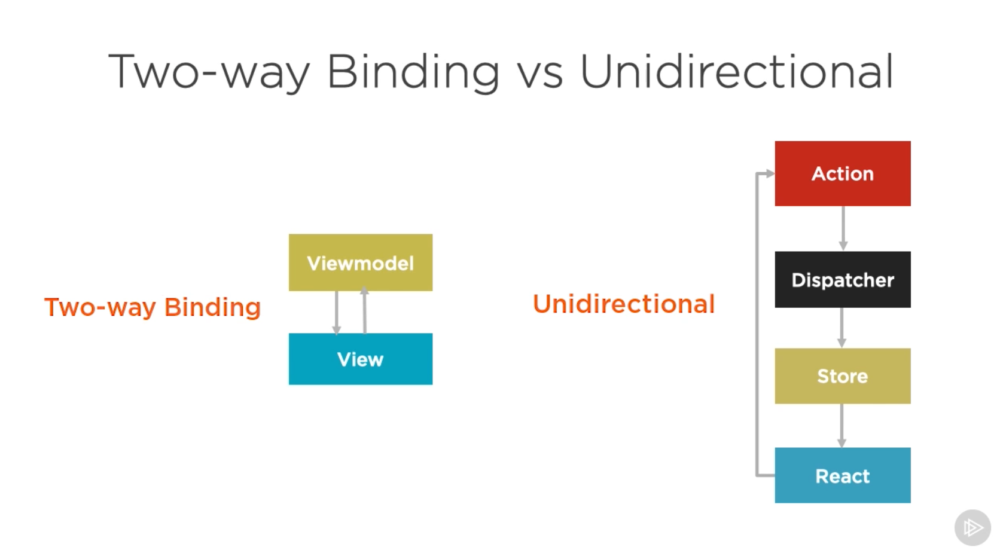
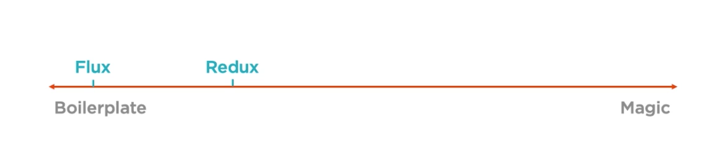
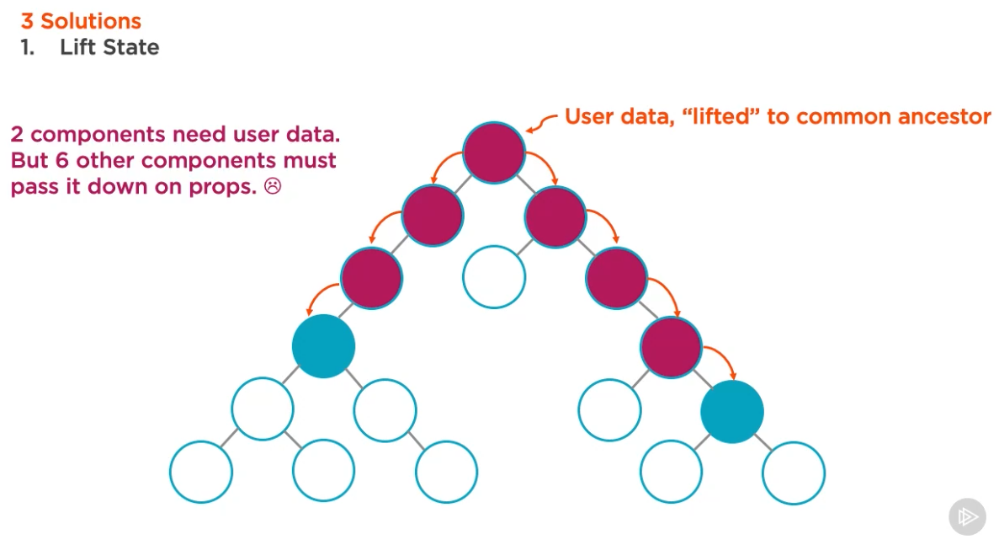
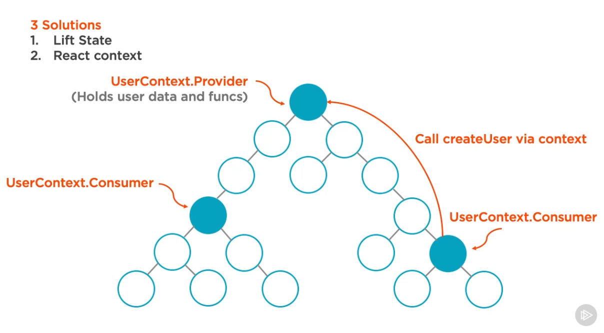
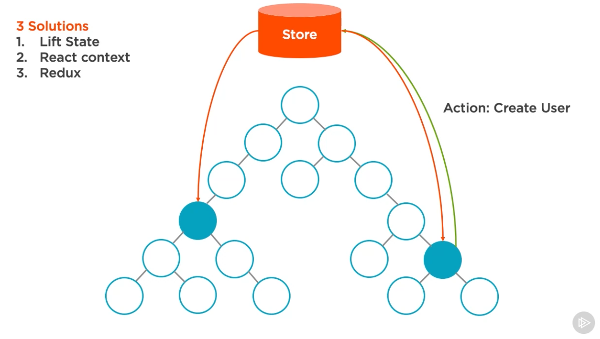
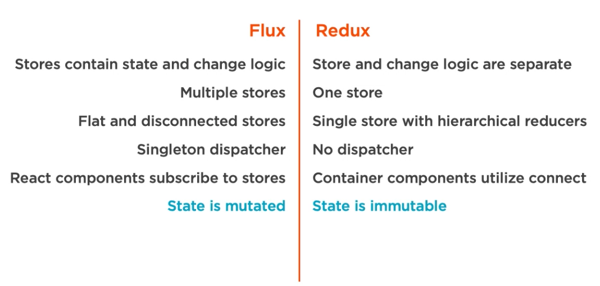
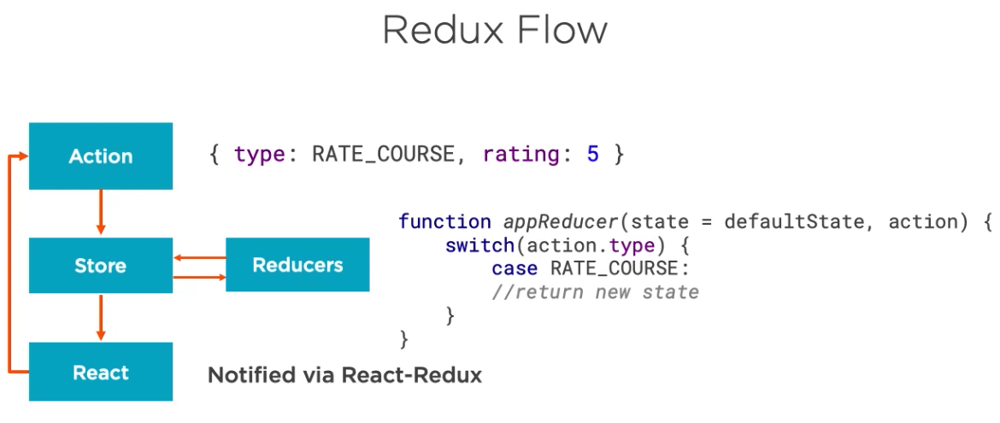

# Building Applications with React and Redux

(Pluralsight Course by Cory House)

## Short Recap on the Redux alternative/foundation: Flux

Flux

-   is used on facebook.com
-   Flux is not a library/framework, it's just a name for a pattern of unidirectional dataflows
-   many different implementations of that pattern exist. One of them: Redux
-   All updates to the app's state occur through a centralized dispatcher
-   That pattern enforces unidirectional data flows

Compare two-way binding with unidirectional binding:

-   two-way binding is simpler conceptually and requires writing less code
-   unidirectional data flow pays off as the application grows because it's more explicit, more scalable, testable and predictable



### 3 Parts/Concepts

1. **Action**: Actions describe user interactions that occur react components (e.g., clicking a delete button). Actions are handled by a centralized dispatcher.
2. **Dispatcher**: The dispatcher is a singleton registry, basically just a list of callbacks functions. It's making calls to stores.
3. **Store**: Hold app state and logic.

#### Actions

**Actions** encapsulate events that can happen in an application, triggered by user interactions, server or browser events. Actions are the payload delivered by the dispatcher to the store(s). **Action creators** are dispatcher helper methods that describe all the actions that are possible in the application. Typically, related action creators are grouped together in a file (e.g., the `courseActions.js` file may contain action creators `loadCourses`, `saveCourse` and `deleteCourse`). Action creator methods include an `actionType` (in the payload passed to dispatcher) that is stored in a constants file (like `actionTypes.js` ). The payload typically also contains some data.

Example action payload passed to dispatcher:

```js
{
    type: "USER_SAVED",
    data: {
        firstName: "Thomas",
        lastName: "Holst"
    }
}
```

Actions are typically triggered in two places:

1. When a user interacts with a user interface, the view will call the appropriate action.
2. From server, when the page loads or when server requests return.

#### Dispatcher

All data flows through the central singleton hub - the dispatcher. Stores register with the dispatcher, so they can be notified when the data changes. So, the dispatcher holds a list of callbacks. When the dispatcher is called with an action payload it broadcasts that payload to the registered callbacks (which handle how that action affects the stores).

#### Stores

Stores hold application

-   state
-   logic
-   data retrieval methods

A store is not a model in an MVC-sense. It _contains_ models.
An app can have one or many stores. As an app gets larger it may become handy to create multiple stores and to keep related data together in a well-named store. Stores get updated because they callbacks that they register with the dispatcher.

Flux' stores use Node's `EventEmitter`. This allows stores to listen to and broadcasts events. It allows react components to update based on these events. The react components listen to the stores. Stores emit changes using EventEmitter. This way, the components find out that the state has changed. They will then use the store's data to render themselves.

**The Structure of a Store**

Every store has this common interface:

-   extends `EventEmitter`
-   `addChangeListener` and `removeChangeListener`
-   `emitChange`

**Dependencies between stores**

In larger applications with multiple stores, the dispatcher can be used to manage dependencies between stores by invoking the registered callbacks in a specific order. Stores can declaratively wait for other stores to finish updating, and then update themselves accordingly.

**Controller Views**

-   Top-level component
-   Controls data flows for its child components, by setting props on them
-   Interacts with stores, i.e., controller views directly receive updates from stores (whereas their child components receive updates indirectly through their parent controller views)
-   **Smart** Component not Dumb Component
-   **Container** Component not Presentation Component
-   Idea: Creating separate components for logic and markup can make components easier to maintain and reuse.

**Differences to Publish-Subscribe Model**

1. Every payload is dispatched to all registered callbacks (publish-subscribe is event-/channel-specific)
2. Callbacks can wait for other callbacks using `waitFor` (publish-subscribe does not typically have a notion of inter-subscriber dependencies)

## Why Redux?

-   Redux enforces **single** store
-   Reduced boilerplate compared to Flux
-   Container components are subscribed to redux store automatically
-   No separate dispatcher
-   Server-Side Rendering (somorphic/Universal JS) friendly ???
-   Immutable Store: performance benefit, enables hot reloading without using client side state
-   time-travel debugging
-   small (weighs 2kB)
-   React's most popular library



## Dev Environment

-> starter projects for react can be found @ javascriptstuff.com, e.g., `create-react-app` or `gatsby`

**target setup**

Environment will

-   compile JSX
-   transpile modern JS
-   Linting
-   generate index.html
-   reload on save
-   do all of the above in a single command

**Manual Steps**

1.  Install Node.js
2.  Create Project Folder
3.  run npm init
4.  npm install
    1. see list of packages in package.json of exercise files
5.  optional: intall prettier vscode plugin
6.  optional: intall eslint vscode plugin
7.  create `src` folder
8.  in `src` create files:

    1. `index.html` with `app` dom node

        ```html
        <!DOCTYPE html>
        <html lang="en">
            <head>
                <meta charset="utf-8" />
                <title>Pluralsight Redux</title>
            </head>

            <body>
                <div id="app"></div>
            </body>
        </html>
        ```

    2. `index.js`, importing React and ReactDom.render

        ```jsx
        import React from "react";
        import { render } from "react-dom";

        function Hi() {
            return <p>Hi.</p>;
        }

        render(<Hi />, document.getElementById("app"));
        ```

9.  create dev config for webpack `webpack.config.dev.js` in root folder (webpack is used for bundling and as a dev server). Note that the webpack config is a js object:

    1. imports (using CommonJS as node does not yet support ES modules; alternatively babel-node could be used)
        ```js
        const webpack = require("webpack");
        const path = require("path");
        const HtmlWebpackPlugin = require("html-webpack-plugin");
        ```
    2. declare node environment
        ```js
        process.env.NODE_ENV = "development";
        ```
    3. to configure webpack we export a javascript object. To export objects in CommonJS we say
        ```js
        module.exports = {...}
        ```
    4. set webpack to development node:
        ```js
        mode: "development",
        ```
    5. set target to web (Compile for usage in a browser-like environment):
        ```js
        target: "web";
        ```
    6. set dev tool to create source maps for debugging (to see original instead of transpiled and minified code when debugging in browser):
        ```js
        devtool: "cheap-module-source-map";
        ```
    7. declare app entry point to be the just created `index.js` file:
        ```js
        entry: "./src/index";
        ```
    8. declare where webpack should put the output (Note: in development mode, webpack does not actually create any files, it serves the app from memory), path is current dir plus "build", public is the relative URL that is mapped to that path, filename is the (virtual) filename of the bundle which will be referenced inside the html file:
        ```js
        output: {
            path: path.resolve(__dirname, "build"),
            public: "/",
            filename: "bundle.js"
        }
        ```
    9. configure webpack's dev server (stats minimal reduces noise on command line, overlay any errors in the browser's console, historyApiFallback will make all urls go through index.js using react router), the last three are to handle an issue with chrome:

        ```js
        devServer: {
            stats: "minimal",
            overlay: true,
            historyApiFallback: true,
            disableHostCheck: true,
            headers: { "Access-Control-Allow-Origin": "*" },
            https: false
        }
        ```

    10. configure plugins:
        ```js
        plugins: [
            new HtmlWebpackPlugin({
                template: "src/index.html",
                favicon: "src/favicon.ico"
            })
        ];
        ```
    11. configure module (call babel for all js/jsx files, allow regular import of css files and make webpack bundle them together):
        ```js
        module: {
            rules: [
                {
                    test: /\.(js|jsx)$/,
                    exclude: /node_modules/,
                    use: ["babel-loader"]
                },
                {
                    test: /(\.css)$/,
                    use: ["style-loader", "css-loader"]
                }
            ];
        }
        ```
    12. the final complete webpack config should look like:

        ```js
        const webpack = require("webpack");
        const path = require("path");
        const HtmlWebpackPlugin = require("html-webpack-plugin");

        process.env.NODE_ENV = "development";

        module.exports = {
            mode: "development",
            target: "web",
            devtool: "cheap-module-source-map",
            entry: "./src/index",
            output: {
                path: path.resolve(__dirname, "build"),
                publicPath: "/",
                filename: "bundle.js"
            },
            devServer: {
                stats: "minimal",
                overlay: true,
                historyApiFallback: true,
                disableHostCheck: true,
                headers: { "Access-Control-Allow-Origin": "*" },
                https: false
            },
            plugins: [
                new HtmlWebpackPlugin({
                    template: "src/index.html",
                    favicon: "src/favicon.ico"
                })
            ],
            module: {
                rules: [
                    {
                        test: /\.(js|jsx)$/,
                        exclude: /node_modules/,
                        use: ["babel-loader", "eslint-loader"]
                    },
                    {
                        test: /(\.css)$/,
                        use: ["style-loader", "css-loader"]
                    }
                ]
            }
        };
        ```

10. configure babel (to transpile modern JS and JSX ). Babel can be configured via `.babelrc` or `package.json` (used here):
    1. babel related packages:
        ```json
        "@babel/core": "7.3.4",
        "babel-eslint": "10.0.1",
        "babel-loader": "8.0.5",
        "babel-preset-react-app": "7.0.2",
        ```
    1. `babel` config section in `package.json` using _react preset_ (to transpile JSX and modern JS):
        ```json
        "babel": {
            "presets": [
                "babel-preset-react-app"
            ]
        }
        ```
11. add npm scripts to `scripts` section in `package.json`

    1.  add script to start application via webpack dev server (using config from above):

        ```json
        "script": {
            "start": "webpack-dev-server --config webpack.config.dev.js --port 3000"
        }
        ```

12. configure eslint. Eslint can be configured using `.eslintrc` or in `package.json` (used here)
    1.  eslint related packages:
        ```json
        "eslint": "5.15.2",
        "eslint-loader": "2.1.2",
        "eslint-plugin-import": "2.16.0",
        "eslint-plugin-react": "7.12.4",
        ```
    2.  `eslintConfig` section in `package.json` (use recommended rules for react and imports; choose babel-eslint parser with ES2018, JSX and ES modules; specify environments, e.g., to ignore their global variables; overwrite some rules for typical development-time issues; tell eslint-plugin-react to detect react version automatically; tell eslint that this config applies to this folder):
        ```json
        "eslintConfig": {
            "extends": [
                "eslint:recommended",
                "plugin:react/recommended",
                "plugin:import/errors",
                "plugin:import/warnings"
            ],
            "parser": "babel-eslint",
            "parserOptions": {
                "ecmaVersion": 2018,
                "sourceType": "module",
                "ecmaFeatures": {
                    "jsx": true
                }
            },
            "env": {
                "browser": true,
                "node": true,
                "es6": true,
                "jest": true
            },
            "rules": {
                "no-debugger": "off",
                "no-console": "off",
                "no-unused-vars": "warn",
                "react/prop-types": "warn"
            },
            "settings": {
                "react": {
                    "version": "detect"
                }
            },
            "root": true
        }
        ```
    3.  add eslint loader to webpack module loader rules in `webpack.config.dev.js` (rules are executed last-to-first, i.e., "run eslint first, then run babel"):
        ```js
        module: {
            rules: [
                {
                    test: /\.(js|jsx)$/,
                    exclude: /node_modules/,
                    use: ["babel-loader", "eslint-loader"]
                },
                {
                    test: /(\.css)$/,
                    use: ["style-loader", "css-loader"]
                }
            ];
        }
        ```

## React Component Approaches

### 4 ways to write react components

1. createClass component
    ```jsx
    var HelloWorld = React.createClass({
        render: function() {
            return <h1>Hello World</h1>;
        }
    });
    ```
2. ES class component

    ```jsx
    class HelloWorld extends React.Component {
        constructor(props) {
            super(props);
        }

        render() {
            return <h1>Hello World</h1>;
        }
    }
    ```

3. Function component
    ```jsx
    function HelloWorld(props) {
        return <h1>Hello World</h1>;
    }
    ```
4. arrow function component
    ```jsx
    const HelloWorld = props => <h1>Hello World</h1>;
    ```

### Benefits of Functional React Components

-   easier to understand
-   avoid `this` keyword
-   transpiled code much smaller
-   higher signal-to-noise ratio (= less boilerplate code)
-   enhanced code completion (intellisense) when used with destructured props
-   pure functions are easier to test
-   performance (no wrapper instance created since react 16)
-   classes may be removed in the future (they will mostly be replaced by functional components + react hooks)

### When should I use each

**Pre react 16.8**

|             Class Component | Function Component |
| --------------------------: | :----------------- |
|                       State | Everywhere else    |
|                        Refs |                    |
|           Lifecycle Methods |                    |
| (e.g., `componentDidMount`, |                    |
|       `componentWillMount`) |                    |

**After react 16.8**

|         Class Component | Function Component |
| ----------------------: | :----------------- |
|       componentDidError | Everywhere else    |
| getSnapshotBeforeUpdate |                    |

### Container vs. Presentation Components

|                                                     Container | Presentation                                      |
| ------------------------------------------------------------: | :------------------------------------------------ |
|                         focus on behavior, only little markup | nearly all mark-up                                |
|                                the "backend" for the frontend | the actual visual frontend                        |
| pass data and actions down to child presentational components | receive data and actions via props                |
|                                                often stateful | typically without state                           |
|                                             knows about redux | does not know about redux (relying only on props) |
|    (redux-specific code for dispatching actions to the store, |                                                   |
|    and connecting to the store via redux' `connect` function) |                                                   |

**Also called:**

|       Container | Presentation   |
| --------------: | :------------- |
|       Container | Presentational |
|           Smart | Dumb           |
|        Stateful | Stateless      |
| Controller View | View           |

## App Structure

-   src/
    -   index.js
    -   index.css
    -   components/
        -   App.js
        -   PageNotFound.js
        -   common/
            -   Header.js
        -   about/
            -   AboutPage.js
        -   courses/
            -   CoursesPage.js
        -   home/
            -   HomePage.js
            -
-   package.json
-   webpack.config.dev.js

## Redux

### Alternatives

1. Lift State
    - data needed by two separate component is "lifted" to their common ancestor
    - all ancestors in between need to pass data down ("Prop Drilling")
    - 
2. React context
    - a central component acts a _context provider_
    - components depending on that data are _context consumers_
    - 
3. Redux
    - central store (like a client-side database)
    - components can connect to store and send actions
    - 

### When to use each?

**Redux**
"If you aren't sure if you need it, you don't need it."

1. Start with state in a single component.
2. Lift state as needed.
3. Try context or redux when lifting state gets annoying.

### Redux core principles

1. one immutable store
2. actions trigger changes
3. reducers update state (pure functions that accepts current state and action, and returns a new state)

### Redux vs. Flux



### Redux Flow



### Actions

An action is a simple JavaScript object with a `type` field and some payload data. Note that the type value `RATE_COURSE` is a constant that is typically defined in some constants file.

```js
// Action Example
{
    type: RATE_COURSE,
    rating: 3
}
```

Actions are typically created with helper function called _action creators_. They typically have the same name as the action type. This pattern encapsulates the action's inner structure, so that code that needs to dispatch an action does not know its inner structure.

### Store

```js
let store = Redux.createStore(reducer);

// API
store.dispatch(action);
store.subscribe(listener);
store.getState();
store.replaceReducer(nextReducer);
```

### Immutability